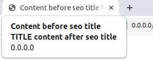
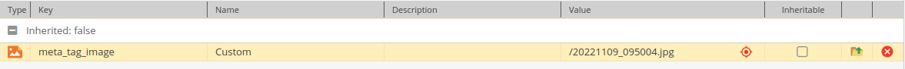
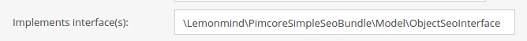
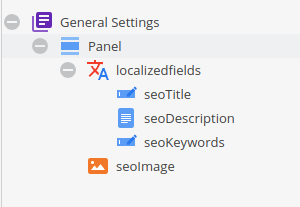

# Simple seo bundle for OpenDXP

Seo package that allows you to complete metadata very quickly

## Installation
```
composer require in-square/opendxp-seo-bundle
```

in the `config/bundles.php` file add
```php
return [
    // another bundles
    InSquare\OpendxpSeoBundle\InSquareOpendxpSeoBundle::class => ['all' => true],
];
```

in the `config/packages/in_square_opendxp_seo.yaml` file add
### Basic configuration
```yaml
in_square_opendxp_seo: ~
```

#### Meta image thumbnail
Set `thumbnail_name` to an existing image thumbnail definition from OpenDXP.

```yaml
in_square_opendxp_seo:
    thumbnail_name: 'meta_tag_image'
```

#### Title pattern

```yaml
in_square_opendxp_seo:
    title_pattern:
        before: 'Content before seo title'
        after: 'content after seo title'
```

#### Hreflang x-default language
By default, `x-default` points to the URL of OpenDXP `defaultLanguage`.
You can override this behavior by setting a preferred language for `x-default`.
If the configured language version does not exist for a given page/object, the bundle falls back to OpenDXP `defaultLanguage`.

```yaml
in_square_opendxp_seo:
    hreflang:
        x_default_language: 'en'
```


## Usage

in base template add
```html
<head>
    {{ render_seo_tags() }}
</head>
```

### Document
Just complete the fields in the SEO section and create (optional) a custom property named **meta_tag_image** with the asset for the document.

If you want to provide keywords, use document property **seo_keywords** (text). This bundle also provides **seo_keywords** as a predefined property for documents.



in `controller` add
```php
public function defaultAction(DocumentSeoMetaGenerator $seoMetaGenerator): Response
{
    $seoMetaGenerator->generate($this->document);

    return $this->render('default/default.html.twig');
}
```

### Object
An interface should be added to the object definition `\InSquare\OpendxpSeoBundle\Model\ObjectSeoInterface`


Then, according to the interface(`\InSquare\OpendxpSeoBundle\Model\ObjectSeoInterface`), create the necessary fields


 
- seoTitle (text->input)
- seoDescription (text->textarea)
- seoKeywords (text->input)
- seoImage (media->image)


in controller
```php
public function seoObjectAction(ObjectSeoMetaGenerator $seoMetaGenerator): Response
{
    /**
     * @var ObjectSeoInterface $test
     */
    $test = Test::getById(1);
    $url = 'absolute url to this object';

    $seoMetaGenerator->generate($test, $url);

    return $this->render('default/default.html.twig');
}
```
